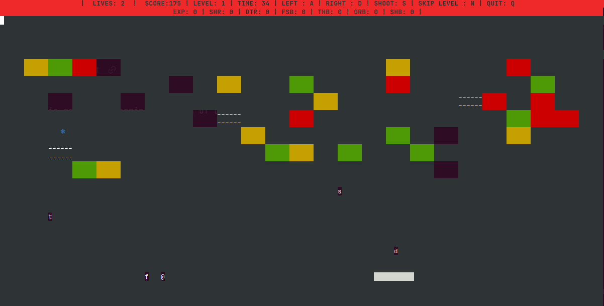
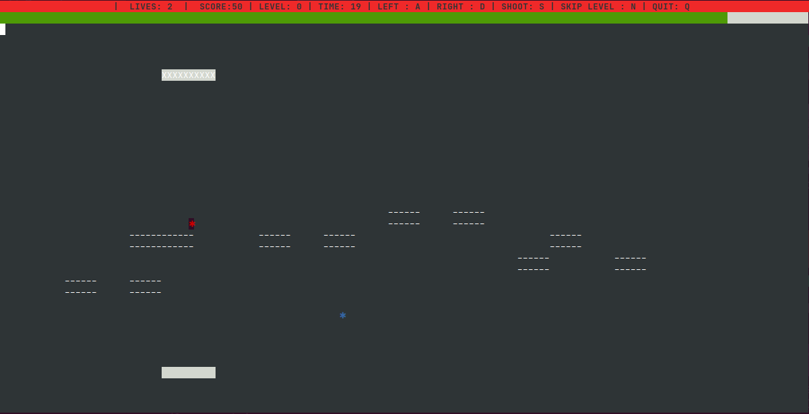

# Break-it

This game is a terminal version of DX-Ball. 

## Rules

**a** - To move left

**d** - To move right

**space** - To release ball

**n** - To skip level

[comment]: <> (**s** - To shoot bullet)
**.** - To drop bombs from Boss

**q** - To quit

## Features

* Initially, the ball would appear randomly on any part of the paddle. The player can move and release the
ball at their will.
* Bricks have different colors to indicate their strength.
    * Red > Yellow > Green
  * Bricks with more strength Bricks with more strength require more hits to make them disappear.
  * With decrease in the strength of a brick due to hits from the ball, the color of the brick must change
  accordingly.
  * Rainbow bricks change their color regularly.
  * Unbreakable bricks which are black, cannot be broken by the ball.
  * Upon reaching the fixed time, every time the ball hits the paddle the brick layout shifts itself downward
by 1 unit(towards the paddle).
  *Once the lowest brick in the current brick layout reaches the paddle level, the game is over(not just
losing a life).
* Power-ups last for 10 seconds each.
  * They appear as catch-able objects randomly on destroying a brick.
  * The power-up is activated on catching it with the paddle.
  * Expand paddle (EXP-e)
    * Increases the size of the paddle by a certain amount.
  * Shrink paddle (SHR-s)
    * Reduce the size of the paddle by a certain amount.
  * Double trouble (DTR-d)
    * Each of the balls which are present will be further divided into two.
    * If a ball is lost, the other ball will be divided into two.
    * A life is lost only if both the balls are lost.
  * Fast ball (FSB-f)
    * Increases the speed of the ball.
  * Thru ball (THB-t)
    * Allows the ball to destroy any brick in its way including the unbreakable brick.
  * Paddle grab (GRB-g)
    * The paddle can grab the ball on contact and relaunch the ball at will.
    * The ball will follow the same expected trajectory after release, similar to the movement expected without the grab.
  * Paddle shoot (shoot bullet) (SHB-@)
    * Allows the paddle to shoot two bullets at a time with strength equal to a ball.
    * Paddle changes to red with white stripes when this power-up is picked up.
* Collecting a power-up which is already active, increases its time limit by 10 seconds.
* Lives, score, time played and controls will be displayed at top of the screen.
* Time remaining for each power-up will be displayed on the screen.
* The game consists of four levels 1,2,3 and 0(BOSS level)
* Boss enemy have 10 lives. The health bar of the boss is displayed on te screen in final level.
  * Boss enemy follows the paddle and drops bombs regularly. On being hit by these bombs the paddle looses one life.
  * Boss enemy will be able to spawn defensive bricks around it(not unbreakable ones) after it’s health falls
below 7 and 4. These bricks will form a layer under the Boss and breaking of these bricks would not yield a
power-up.